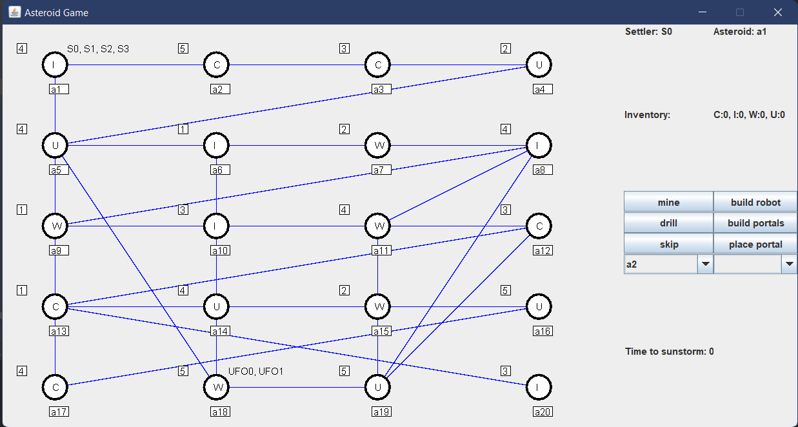

# Asteroid game

A projekt egy GUI-val rendelkező desktop játék, amely lehetőséget ad a játékosok számára, hogy telepeseket irányítsanak egy aszteroidaövben, miközben különböző kihívásokkal kell megbirkózniuk.

## Fontosabb funkciók

- Telepesek mozgatása aszteroidák között
- Aszteroidák fúrása, benne található nyersanyag kibányászása
- Segédeszközök építése nyersanyagok felhasználásával
- Veszélyek: időszakos napviharok, napközelben az urán felrobbanhat

## Játék vége

Ha minden nyersanyagot összegyűjtenek a telepesek egy közös aszteroidán, akkor meg tudják építeni a bázist, ezzel megnyerve a játékot.
