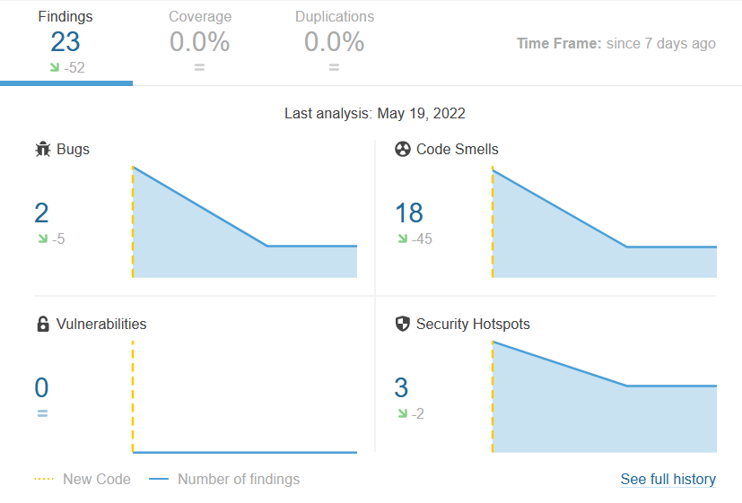

# SonarCloud �s manu�lis k�d�tvizsg�l�s

## SonarCloud

A SonarCloud-hoz val� hozz�f�r�shez adminisztr�tor jogot kellett k�rn�nk, miut�n ezt megkaptuk, elkezdt�k felconfigolni.
Id�k�zben r�j�tt�nk, hogy eln�zt�k, �s m�sik felhaszn�l� kapott admin jogot, mint amire mi sz�m�tottunk. Ezut�n a
f�lre�rt�s ut�n m�r g�rd�l�kenyen ment a felconfigol�s, kieg�sz�tett�nk a `pom.xml` �s `maven.yml` f�jlokat.

A SonarCloud fel�lete kijelezte a hib�kat, ezek nagy r�sz�t jav�tottuk. Minden pushol�skor a GitHub Actions mellett a
SonarCloud ki�rt�kel�je is lefutott a GitHub fel�let�n. Az eredeti ~100 code smellt �s bugot nagyj�b�l 20-ra cs�kkentett�k.

## Manu�lis k�d�tvizsg�l�s

A k�dot manu�lisan is �tn�zt�k, de nem igaz�n tal�ltunk olyan hib�kat, amiket a SonarCloud anal�zise nem mutatott ki.
Legink�bb csak n�h�ny kommentet m�dos�tottunk, �s n�h�ny helyen �talak�tottuk a t�rdel�st. 

