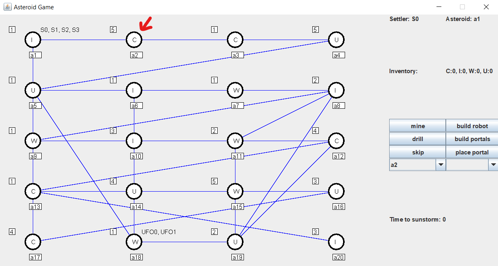
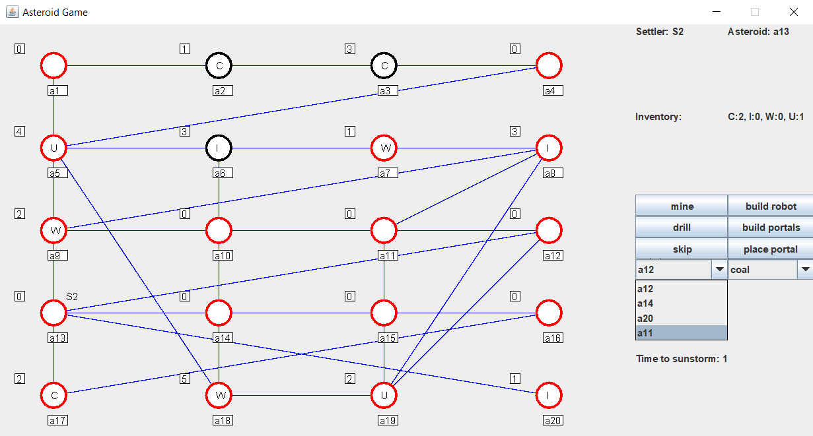
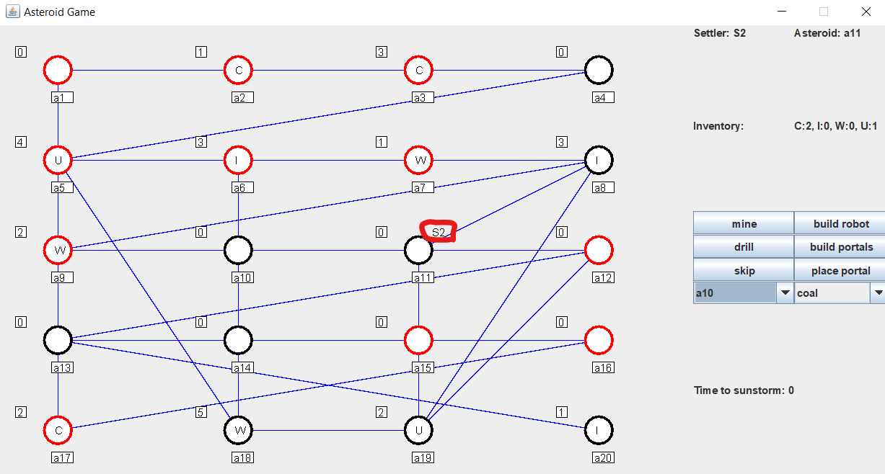
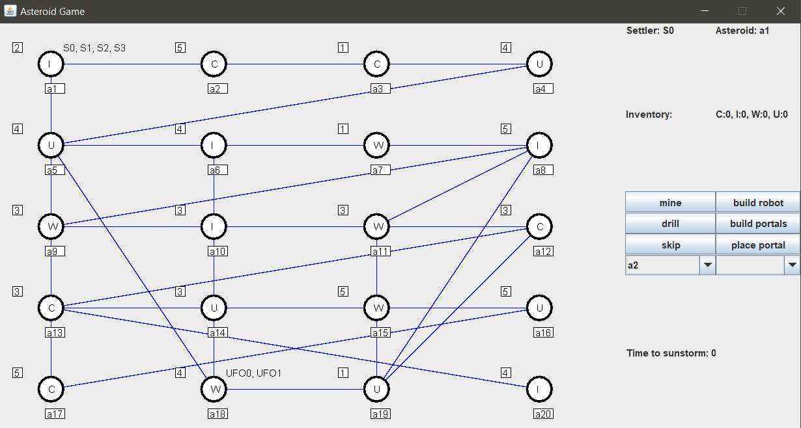
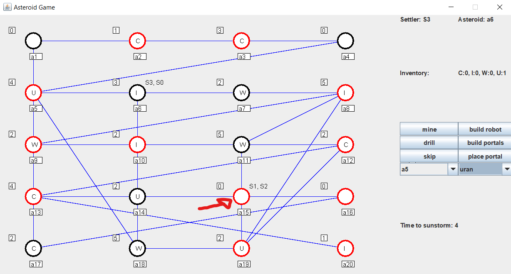
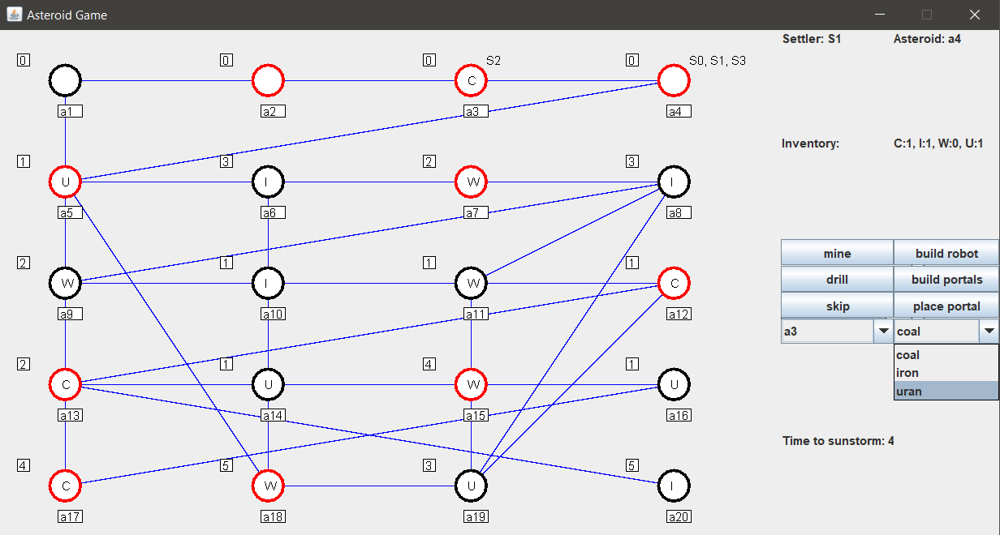
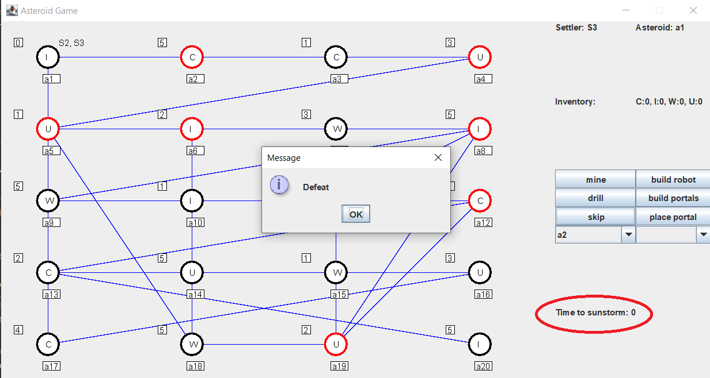

# Move settler

## Cél

Egy telepest átmozgatni az egyik aszteroidárol egy másikra (a1 >> a15)
## Megvalósítás

A szomszédos aszteroidákat listázó legördülő menüből mindig olyan aszteroidát válasszunk amivel közelebb kerülünk a célhoz.
Jelen esetben

[ a1 - a17 - a16 - a15 ]

## Eredmények

A teszt sikeresen végrehajtható.

---

# Mine Material

## Cél

A telepeseket a2-re mozgatva bányásszuk ki az ott található szenet.
## Megvalósítás

Először mozgassuk át a telepeseket a2 aszteroidára.
Fúrással csökkentsük az aszteroida rétegeinek számát nullára.
Ha ez sikerült a soron lévő telepessel kibányászhatjuk az alapanyagot

## Eredmények

A teszt sikeresen végrehajtható.

---

# Build Portal and travel through Portal

## Cél

Portálhoz szükséges alapanyagok összegyűjtése egy telepesnél. (2 iron, 1 water, 1 uran)
Portál építése.

Portálok lehelyezése két nem szomszédos aszteroidára. (a13 és a11)

Mozgás a portál segítségével

## Megvalósítás

Az összes telepessel csökkentsük azon aszteroidák vastagságát, amik szükséges materialokat tartalmaznak.
Figyeljünk rá, hogy ugyanazzal a telepessel bányásyzuk ki az alapanyagokat.
Ha megvannak a szükséges alapanyagok, a telepessel építsünk egy portál-párt.
Helyezzük le az egyiket egy aszteroidára.
Több kör alatt mozogjunk át ezzel a telepessel egy, az előzővel nem szomszédos aszteroidára.
Rakjuk le a portál párját.
Mozogjunk a telepessel a portálon keresztül
## Eredmények

A teszt sikeresen végrehajtható.

A képeken látszik, hogy a mozgáshoz felkínált célaszteroidák között megjelent a portálos is. (a11)

Valamint az is, hogy a telepes sikeresen mozgatható.

---

# Exposed waterice evaporates when sun is close

## Cél

Nézzük meg hogy a waterice tényleg elpárolog e ha a feltételek teljesülnek.

## Megvalósítás

Keressünk egy aszteroidát ami waterice-t tartalmaz

Csökkentsük rétegeinek számát 0ra.

skippeljünk minden telepessel addig amig az előző aszteroida napközelbe kerül.

Ekkor a waterice-nak el kell párolognia.

## Eredmények

A teszt sikeresen végrehajtható.

---
# Build robot

## Cél

Egy telepessel megfelelő mennyiségű nyersanyagot (egy vas, egy szén, egy urán) gyűjteni, majd egy robotot építeni.
## Megvalósítás

A szomszédos aszteroidákat listázó legördülő menüből mindig olyan aszteroidát válasszunk, amivel közelebb kerülünk
a megfelelő nyersanyagokat tartalmazó aszteroidákhoz, fúrjuk ki őket, bányásszuk ki a nyersanyagot, majd ha megvan
a megfelelő mennyiség, építsük meg a robotot.

## Eredmények

A nyersanyaggyűjtés megvalósítható, de a robot építése hibára fut:

A hiba (`ConcurrentModificationException`) a Game osztály game() metódusában, a Steppable objektumok léptetéséért
felelős ciklusban következik be. A robot megépítésével egy külön szálról új objektum kerülne a Steppable elemeket
tartalmazó listába, amin azonban még iterál az eredet metódus is.
A megoldás szálbiztos kollekció használata lehet. Például a `java.util.concurrent.CopyOnWriteArrayList<E>` osztály
megfelelő lenne, ennek `add(E e)` függvénye szálbiztos.

# Defeat

## Cél

Egy telepesekkel maradjunk egy nem teljesen kifúrt aszteroidán, és várjuk meg, amíg egy napvihar megöli őket.
## Megvalósítás

Sokféleképpen megoldható, célszerűen a játék kezdetétől minden telepes pihenjen minden körben a `skip` gombbal (a 
napviharok térben nemdeterminisztikusak, úgyhogy javasolt a Field osztályban az ezért felelős metódusokat(`sunStorm()`
és `decreaseTimer()`) megfelelően módosítani, hogy hamar napviharhoz érjünk).

## Eredmények

Kivárva a napvihart a telepesek tényleg meghalnak, és ezzel a játékot is elveszítjük:

