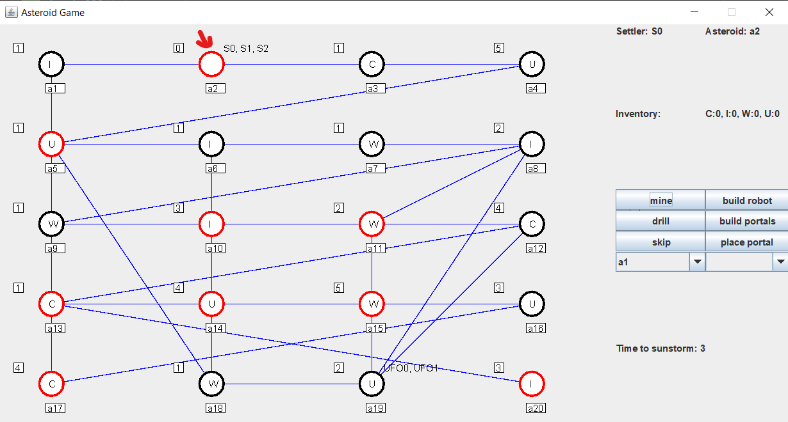

# Move settler

## Cél

Egy telepest átmozgatni az egyik aszteroidárol egy másikra (a1 >> a15)
## Megvalósítás

A szomszédos aszteroidákat listázó legördülő menüből mindig olyan aszteroidát válasszunk amivel közelebb kerülünk a célhoz.
Jelen esetben

[ a1 - a17 - a16 - a15 ]

## Eredmények

A teszt sikeresen végrehajtható.

---

# Mine Material

## Cél

A telepeseket a2-re mozgatva bányásszuk ki az ott található szenet.
## Megvalósítás

Először mozgassuk át a telepeseket a2 aszteroidára.
Fúrással csökkentsük az aszteroida rétegeinek számát nullára.
Ha ez sikerült a soron lévő telepessel kibányászhatjuk az alapanyagot

## Eredmények

A teszt sikeresen végrehajtható.

---

# Build Portal and travel through Portal

## Cél

Portálhoz szükséges alapanyagok összegyűjtése egy telepesnél. (2 iron, 1 water, 1 uran)
Portál építése.
Portálok lehelyezése két nem szomszédos aszteroidára. (a13 és a11)
Mozgás a portál segítségével
## Megvalósítás

Az összes telepessel csökkentsük azon aszteroidák vastagságát amik szükséges material-t tartalmaznak.
Figyeljünk rá, hogy ugyan azzal a telepessel bányásyzuk ki az alapanyagokat.
Ha megvannak a szükséges alapanyagok a telepessel építsünk egy portál párt.
Helyezzük le az egyiket egy aszteroidára.
Több kör alatt mozogjunk át ezzel a telepessel egy az előzővel nem szomszédos aszteroidára.
Rakjuk le a portál párját.
Mozogjunk a telepessel a portálon keresztül
## Eredmények

A teszt sikeresen végrehajtható.
A képeken látszik, hogy a mozgáshoz felkínált célaszteroidák között megjelent a portálos is. (a11)
Valamint az is, hogy a telepes sikeresen mozgatható.

---