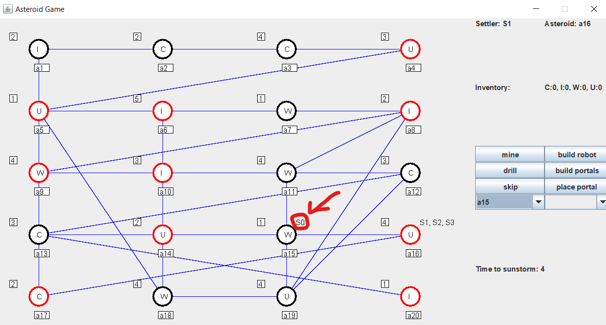

# move settler
## cél
Egy telepest átmozgatni az egyik aszteroidárol egy másikra (a1 >> a15)
## Megvalósítás
A szomszédos aszteroidákat listázó legördülő menüből mindig olyan aszteroidát válasszunk amivel közelebb kerülünk a célhoz.
Jelen esetben

[ a1 - a17 - a16 - a15 ]

## Eredmények
A teszt sikeresen végrehajtható.

---